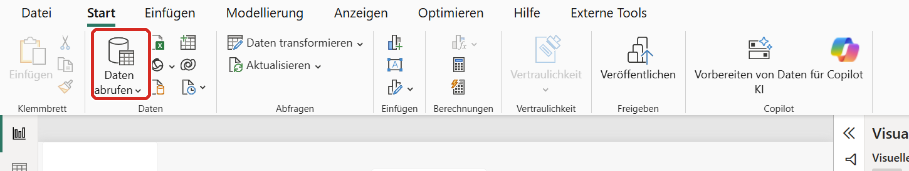
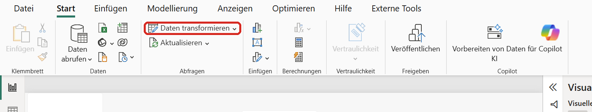
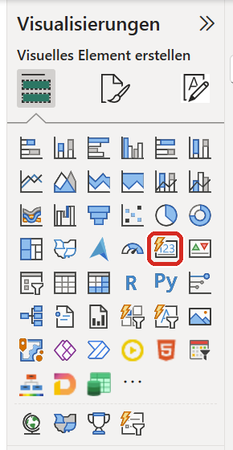
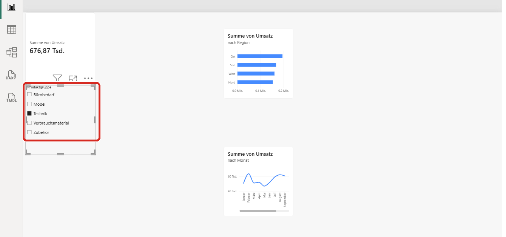
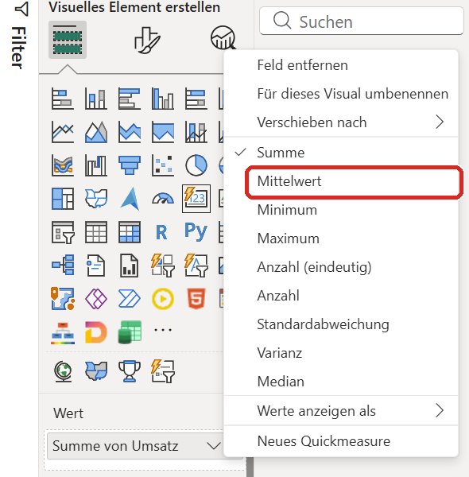
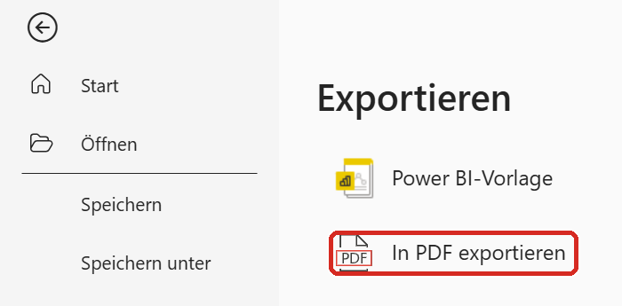

# Tag 1 · Vom Kassen-Export zum ersten Bericht

**Die Aufgabe:** Du arbeitest im Controlling der **Rad & Tat GmbH**, einem Fahrradhändler mit
vier Filialen (Hamburg, Köln, München, Leipzig). Die Geschäftsführung will wissen:
*Wie viel haben wir 2025 umgesetzt, wo, wann – und fällt irgendwo etwas auf?*

Du bekommst dafür einen Export aus dem Kassensystem. Er ist, wie Exporte eben sind: unordentlich.
Am Ende hast du einen Bericht mit Kennzahl, Balken, Linien und Filter – und du hast etwas gefunden,
das auf den ersten Blick niemand sieht.

> ⬇️ **Lieber offline arbeiten?** [Dieses Übungsblatt als PDF mit Daten und Lösung (ZIP)](https://github.com/Losveratos/Power-Starter-24-25-September/raw/main/00-Downloads/Starter-Training-Tag1.zip)

---

## Bevor du anfängst

**Du brauchst:**
- einen **Windows-Rechner** (Windows 10 oder 11). Power BI Desktop gibt es nicht für Mac oder Tablet.
- **Power BI Desktop** – kostenlos, Installation in Übung 0.
- **Internet** – die Daten kommen direkt aus diesem Repo. (Ohne Internet: ZIP oben herunterladen.)
- **kein Konto**, keine Lizenz, keine Vorkenntnisse.
- **Zeit:** etwa 2½ Stunden. Du kannst nach jeder Übung Pause machen – vorher **Strg + S** (speichern).

**So liest du dieses Blatt:**

| Zeichen | Bedeutung |
|---|---|
| **Fett** | So heißt der Knopf oder das Menü in Power BI – genau danach suchen. |
| **A → B → C** | Erst A anklicken, dann B, dann C. |
| ✅ **Kontrollpunkt** | Diese Zahl muss bei dir stehen. Stimmt sie, weiter zur nächsten Übung. |
| 🆘 **Hängst du fest?** | Die häufigsten Fehler und wie du sie behebst. |
| 📚 **Mehr dazu** | Zum Nachlesen: [Knowledge Kitchen](https://datenwgknowledgekitchen.com/) (deutsch, praxisnah) und Microsoft Learn (offizielle Doku). |

> 💡 **Tipp:** Der [Praxis-Pfad der Knowledge Kitchen](https://datenwgknowledgekitchen.com/powerbi_praxis_pfad.html)
> macht dieselben Handgriffe mit anderen Daten und mehr Bildern. Wenn dir hier etwas zu knapp ist, schau dort ins passende Modul.

---

## Übung 0 · Power BI Desktop installieren (15 min)

1. Drücke die **Windows-Taste**, tippe `Store` und drücke **Enter**. Der **Microsoft Store** öffnet sich.
2. Oben im Suchfeld `Power BI Desktop` eingeben → **Installieren** (oder **Herunterladen**). Das dauert ein paar Minuten.
3. Klappt der Store nicht (oft auf Firmenrechnern)? Dann über [Microsoft: Power BI Desktop herunterladen](https://learn.microsoft.com/de-de/power-bi/fundamentals/desktop-get-the-desktop) –
   dafür brauchst du Administratorrechte. Hast du keine, frag deine IT.
4. **Power BI Desktop** starten. Der erste Start dauert etwas länger.
5. Es erscheint ein Fenster, das dich zum Anmelden auffordert → **oben rechts auf das X** klicken. Du brauchst kein Konto.
6. Erscheint ein Startbildschirm mit Vorschlägen → ebenfalls schließen.

**✅ Kontrollpunkt:** Du siehst eine große **leere weiße Fläche**. Oben ein Menüband mit
**Datei · Start · Einfügen · Modellierung · Ansicht · Hilfe**.

🆘 **Hängst du fest?**
- *Du siehst noch ein Anmeldefenster* → es liegt oft **hinter** dem Hauptfenster. Mit **Alt + Tab** nach vorne holen, X klicken.
- *Menüs auf Englisch (Home, Insert …)?* → Das ist dieselbe Software. Umstellen: **File → Options and settings → Options → Regional Settings → Application language: Deutsch**, dann Power BI neu starten.

📚 **Mehr dazu:** Kitchen: [Praxis-Pfad · Modul 0](https://datenwgknowledgekitchen.com/powerbi_praxis_pfad.html#modul-0) ·
[Einsteiger-Guide · Architektur & Komponenten](https://datenwgknowledgekitchen.com/power_bi_einsteiger_guide_v4.html#arch) ·
Microsoft Learn: [Erste Schritte mit Power BI Desktop](https://learn.microsoft.com/de-de/power-bi/fundamentals/desktop-getting-started)

---

## Übung 1 · Daten anbinden (15 min)



1. Im Menüband auf **Start → Daten abrufen** klicken (siehe Bild). Es klappt eine Liste auf.
2. In der Liste **Web** wählen. Steht dort kein *Web*: ganz unten **Mehr…** → links **Andere** → **Web** → **Verbinden**.
3. Ins Feld **URL** diese Adresse kopieren (markieren, **Strg + C**, im Feld **Strg + V**):
   ```
   https://raw.githubusercontent.com/Losveratos/Power-Starter-24-25-September/main/01-Tag-1/Daten/verkaeufe_2025_roh.csv
   ```
   → **OK**.
4. Power BI fragt nach der Anmeldung: links **Anonym** wählen → **Verbinden**.
   *(Anonym heißt: Die Datei ist öffentlich, es braucht kein Passwort.)*
5. Eine Vorschau erscheint. Sie sieht unordentlich aus – **das ist Absicht**.
   Klick unten rechts auf **Daten transformieren** (nicht auf *Laden*!). Ein neues Fenster öffnet sich: der **Power Query-Editor**.
6. Rechts im Bereich **Angewendete Schritte** stehen evtl. schon Einträge wie *Höher gestufte Header* oder *Geänderter Typ*.
   **Lösch alles außer „Quelle"**: auf das kleine **X** links vor dem jeweiligen Schritt klicken.
   Wir wollen jeden Handgriff selbst machen und verstehen.

**✅ Kontrollpunkt:** Die Spalten heißen `Column1` bis `Column8`. In der ersten Zeile steht
`Export RT-Kasse v4.2 | Rad & Tat GmbH | …`, in der zweiten `Belegnummer`, `Belegdatum`, …

🆘 **Hängst du fest?**
- *Fehlermeldung beim Verbinden / „Zugriff verweigert"* → Firmen-Proxy blockt GitHub. Lade die [ZIP](https://github.com/Losveratos/Power-Starter-24-25-September/raw/main/00-Downloads/Starter-Training-Tag1.zip) herunter, entpacke sie (Rechtsklick → *Alle extrahieren*) und lade die Datei über **Start → Daten abrufen → Text/CSV** → Datei `Daten/verkaeufe_2025_roh.csv` → **Daten transformieren**. Der Rest bleibt gleich.
- *Du hast aus Versehen „Laden" geklickt* → kein Problem: **Start → Daten transformieren** öffnet den Editor.
- *Die Spalten haben schon Namen wie „Export RT-Kasse…"* → Schritt 6 fehlt: *Höher gestufte Header* per X löschen.

📚 **Mehr dazu:** Kitchen: [Praxis-Pfad · Modul 1](https://datenwgknowledgekitchen.com/powerbi_praxis_pfad.html#modul-1) ·
Microsoft Learn: [Web-Connector](https://learn.microsoft.com/de-de/power-query/connectors/web/web) ·
[Text/CSV-Connector](https://learn.microsoft.com/de-de/power-query/connectors/text-csv)

---

## Übung 2 · Aufräumen in Power Query (35 min)



In der Datei stecken fünf typische Export-Probleme: eine Müllzeile oben, keine richtigen
Überschriften, leere Zeilen mittendrin, Leerzeichen hinter Filialnamen, uneinheitliche
Groß-/Kleinschreibung – und Zahlen mit **Punkt** als Dezimalzeichen.

Du arbeitest im **Power Query-Editor** (aus Übung 1 noch offen). Mach die 8 Handgriffe **genau in dieser Reihenfolge**.
Nach jedem Handgriff erscheint rechts ein neuer Eintrag unter *Angewendete Schritte*.

| # | Was | So geht's |
|---|---|---|
| 1 | Müllzeile weg | **Start → Zeilen entfernen → Obere Zeilen entfernen** → `1` eintippen → **OK** |
| 2 | Überschriften setzen | **Start → Erste Zeile als Überschriften verwenden** |
| 3 | Leere Zeilen weg | **Start → Zeilen entfernen → Leere Zeilen entfernen** |
| 4 | Leerzeichen abschneiden | Auf die Überschrift **Filiale** klicken (Spalte wird grün) → **Transformieren → Format → Kürzen** |
| 5 | Schreibweise vereinheitlichen | Überschrift **Kategorie** anklicken → **Transformieren → Format → Jedes Wort großschreiben** |
| 6 | Datum ist ein Datum | **Rechtsklick** auf die Überschrift **Belegdatum** → **Typ ändern → Gebietsschema verwenden…** → Datentyp **Datum**, Gebietsschema **Englisch (USA)** → **OK** |
| 7 | Umsatz & Kosten sind Zahlen | **Rechtsklick** auf **Umsatz** → **Typ ändern → Gebietsschema verwenden…** → **Dezimalzahl**, **Englisch (USA)** → **OK**. Dasselbe für **Kosten**. |
| 8 | Menge ist eine ganze Zahl | Links in der Überschrift **Menge** auf das Symbol **ABC** klicken → **Ganze Zahl** |

> **Warum „Gebietsschema"?** In der Datei steht `616.55`. Ein deutsches Windows liest den Punkt
> als Tausendertrennzeichen – aus 616,55 € würden 61.655 €. Mit *Englisch (USA)* sagst du:
> „Diese Datei kommt aus einem System, das den Punkt als Komma benutzt."

**Prüfen, bevor du weitermachst:** Klick bei **Filiale** und bei **Kategorie** auf den kleinen **Pfeil** rechts in der Überschrift.
Dort stehen alle vorkommenden Werte.

Zum Schluss: **Start → Schließen & übernehmen** (ganz links). Der Editor schließt sich, Power BI lädt die Daten.

**✅ Kontrollpunkt:**
- Links am Rand auf das mittlere Symbol **Tabellenansicht** (Gitter) klicken → ganz unten steht **2.877 Zeilen**.
- **Filiale** hat genau **4** Werte, **Kategorie** genau **5** (Bekleidung, E-Bikes, Fahrräder, Werkstatt, Zubehör).

🆘 **Hängst du fest?**
- *Mehr als 4 Filialen* → Handgriff 4 fehlt (`Köln` und `Köln␣` sind für Power BI zwei Filialen).
- *Mehr als 5 Kategorien* → Handgriff 5 fehlt.
- *2.883 Zeilen* → Handgriff 3 fehlt (6 leere Zeilen stecken noch drin).
- *Spalten heißen „Export RT-Kasse …" oder „B100001"* → Handgriff 1 und 2 vertauscht. **Start → Daten transformieren**, rechts alle Schritte außer *Quelle* löschen, neu beginnen.
- *Ein Schritt ist falsch?* → Nichts ist endgültig: rechts den Schritt per **X** löschen und neu machen. Die Ursprungsdatei wird nie verändert.
- *Gar nichts klappt?* → Fertige Lösung: [`Loesungen/Tag1_PowerQuery_Aufraeumen.pq`](Loesungen/Tag1_PowerQuery_Aufraeumen.pq) öffnen → **Copy raw file** (📋 oben rechts) →
  in Power BI **Start → Daten transformieren → Neue Quelle → Leere Abfrage → Erweiterter Editor** → alles markieren, einfügen → **Fertig**.

📚 **Mehr dazu:** Kitchen: [Praxis-Pfad · Modul 2](https://datenwgknowledgekitchen.com/powerbi_praxis_pfad.html#modul-2) ·
[Einsteiger-Guide · Power Query (Datentypen früh setzen, Schlüssel bereinigen)](https://datenwgknowledgekitchen.com/power_bi_einsteiger_guide_v4.html#pq) ·
Microsoft Learn: [Zeilen nach Position entfernen](https://learn.microsoft.com/de-de/power-query/filter-row-position) ·
[Überschriften höher stufen](https://learn.microsoft.com/de-de/power-query/table-promote-demote-headers) ·
[Datentypen und Gebietsschema](https://learn.microsoft.com/de-de/power-query/data-types)

---

## Übung 3 · Erste Antworten: wie viel, wo, wann? (30 min)

Links am Rand auf das **oberste** Symbol klicken: die **Berichtsansicht**. Rechts siehst du zwei Bereiche:
**Visualisierungen** (die Symbole) und **Daten** (deine Tabelle `verkaeufe_2025_roh`).

**Vor jedem neuen Bild:** erst auf eine **leere Stelle** der weißen Fläche klicken – sonst änderst du das vorherige Bild.



**Bild 1 – die große Zahl: Wie viel insgesamt?**
1. Unter **Visualisierungen** auf **Karte** klicken (Symbol mit **123**, siehe Bild – *nicht* die Weltkugel, das ist eine Landkarte).
2. Rechts unter **Daten** die Tabelle aufklappen und das Häkchen bei **Umsatz** setzen.
3. Das Kästchen an einer Ecke größer ziehen, damit die Zahl gut lesbar ist.

**Bild 2 – Balken: Wo?**
4. Leere Stelle anklicken → **Gestapeltes Balkendiagramm** (waagerechte Balken).
5. Häkchen bei **Filiale** und bei **Umsatz**. Der längste Balken sollte oben stehen.
   Falls nicht: über dem Diagramm auf **… (drei Punkte) → Achse sortieren → Umsatz**, danach **… → Achse sortieren → Absteigend sortieren**.

**Bild 3 – Linie: Wann?**
6. Leere Stelle anklicken → **Liniendiagramm**.
7. Häkchen bei **Belegdatum** und **Umsatz**. Du siehst nur **einen Punkt** – Power BI fasst alles zum Jahr zusammen.
8. Rechts unter **Visualisierungen** im Feld **X-Achse** stehen unter *Belegdatum* vier Einträge: **Jahr, Quartal, Monat, Tag**.
   Bei **Jahr**, **Quartal** und **Tag** jeweils auf das **X** klicken. Übrig bleibt **Monat** – jetzt zeigt die Linie 12 Punkte.

**✅ Kontrollpunkt:**
- Karte: **1,24 Mio.** (genau: 1.244.017,12 €)
- Balken: **München** oben (411,51 Tsd.), **Leipzig** unten (184,34 Tsd.)
- Linie: Tiefpunkt **Januar**, Höchstwert **Mai** (162,34 Tsd.), kleiner Buckel im **Dezember** (Weihnachtsgeschäft)

🆘 **Hängst du fest?**
- *Karte zeigt **124,4 Mio.*** → In Übung 2 wurde der Umsatz ohne Gebietsschema umgewandelt. **Start → Daten transformieren**, Schritt für *Umsatz* rechts per X löschen, Handgriff 7 neu machen.
- *Karte zeigt eine kleine Zahl wie 2.877* → dort steht **Anzahl** statt **Summe**. Rechts im Feld **Felder**/**Wert** auf den Pfeil neben *Umsatz* → **Summe**.
- *Karte sieht anders aus als im Bild* → Neuere Power-BI-Versionen haben eine neue Karte. Die Zahl ist dieselbe.
- *Balken zeigen alle gleich lang / nur einen Balken* → Filiale steht im falschen Feld. Filiale gehört in **Y-Achse**, Umsatz in **X-Achse**.

> **Neues Wort – Dimension & Kennzahl.** Die *Kennzahl* ist, was du misst (Umsatz). Die
> *Dimension* ist, wonach du aufteilst (Filiale, Monat). Jedes Diagramm = eine Kennzahl, aufgeteilt nach einer Dimension.

📚 **Mehr dazu:** Kitchen: [Praxis-Pfad · Modul 3](https://datenwgknowledgekitchen.com/powerbi_praxis_pfad.html#modul-3) ·
[Einsteiger-Guide · Visualisierung](https://datenwgknowledgekitchen.com/power_bi_einsteiger_guide_v4.html#viz) ·
Microsoft Learn: [Karten-Visual](https://learn.microsoft.com/de-de/power-bi/visuals/power-bi-visualization-card) ·
[Überblick über Visualisierungen](https://learn.microsoft.com/de-de/power-bi/visuals/power-bi-visualizations-overview)

---

## Übung 4 · Filtern (15 min)



1. Leere Stelle anklicken → unter **Visualisierungen** auf **Datenschnitt** (Symbol: Trichter mit Regler).
2. Häkchen bei **Kategorie**. Im Datenschnitt erscheinen fünf Einträge mit Kästchen. Schieb ihn in eine freie Ecke.
3. Klick im Datenschnitt auf **E-Bikes**. **Schau auf die ganze Seite:** Karte, Balken und Linie ändern sich gleichzeitig.
4. Noch einmal auf **E-Bikes** klicken → Auswahl ist aufgehoben.
5. Jetzt direkt im **Balkendiagramm** auf den Balken **Leipzig** klicken. Wieder reagiert die ganze Seite: Jedes Diagramm ist auch ein Filter.

**✅ Kontrollpunkt:**
- Mit **E-Bikes** im Datenschnitt zeigt die Karte **724,8 Tsd.** – mehr als die Hälfte des Umsatzes.
- Mit Balken **Leipzig** zeigt die Karte **184,34 Tsd.**

Danach: auf eine leere Stelle klicken, damit **kein Filter** mehr aktiv ist.

🆘 **Hängst du fest?**
- *Karte zeigt bei Leipzig eine andere Zahl* → Im Datenschnitt ist noch eine Kategorie markiert. Alle Kästchen leeren, dann erneut auf den Balken klicken.
- *Die anderen Bilder reagieren nicht* → Unter **Format → Interaktionen bearbeiten** wurde etwas verstellt. Einmal auf **Interaktionen bearbeiten** klicken, bis es aus ist.

📚 **Mehr dazu:** Kitchen: [Praxis-Pfad · Modul 4](https://datenwgknowledgekitchen.com/powerbi_praxis_pfad.html#modul-4) ·
[Einsteiger-Guide · Interaktivität](https://datenwgknowledgekitchen.com/power_bi_einsteiger_guide_v4.html#inter) ·
Microsoft Learn: [Datenschnitte](https://learn.microsoft.com/de-de/power-bi/visuals/power-bi-visualization-slicers) ·
[Wie Visuals sich gegenseitig filtern](https://learn.microsoft.com/de-de/power-bi/create-reports/service-reports-visual-interactions)

---

## Übung 5 · Nicht jede Zahl darf man addieren (25 min)

Die Geschäftsführung fragt nach der **Marge** (wie viel vom Umsatz übrig bleibt). Die gibt es in der Datei nicht – also rechnen wir sie.

**Marge ausrechnen**
1. **Start → Daten transformieren** (zurück in den Power Query-Editor).
2. **Spalte hinzufügen → Benutzerdefinierte Spalte**. Oben als Name `Marge` eintragen, unten als Formel:
   ```
   ([Umsatz] - [Kosten]) / [Umsatz]
   ```
   → **OK**.
3. Links in der Überschrift der neuen Spalte **Marge** auf das Symbol **ABC123** klicken → **Dezimalzahl**.
4. **Start → Schließen & übernehmen**.

**Erst der Fehler**
5. Zurück in der Berichtsansicht: leere Stelle → **Karte** → Häkchen bei **Marge**.

Die Karte zeigt rund **1.291** (angezeigt als *1,29 Tsd.*). Eine Marge von 129.100 %? Power BI hat alle
2.877 Einzelmargen **addiert** – das macht es bei jeder Zahlenspalte automatisch.

**Dann die Reparatur**



6. Rechts unter **Visualisierungen** steht im Feld **Felder** (bzw. **Wert**) `Summe von Marge`. Auf den kleinen **Pfeil** daneben klicken → **Mittelwert**.
7. Jetzt steht dort etwa `0,45` – richtig, aber schlecht lesbar. Als Prozent formatieren:
   links **Tabellenansicht** (Gitter) → Überschrift **Marge** anklicken → oben im Reiter **Spaltentools** auf das **%**-Zeichen →
   **Dezimalstellen** auf `1` → zurück zur **Berichtsansicht** (oberstes Symbol links).

**✅ Kontrollpunkt:** Die Karte zeigt **44,9 %**.

> ⚠️ **Merk dir das für Tag 2:** Auch 44,9 % ist nicht die „richtige" Marge. Ein Mittelwert über Zeilen zählt den
> 20-€-Schlauchwechsel genauso wie das 5.000-€-Lastenrad. Richtig ist
> *Summe Deckungsbeitrag ÷ Summe Umsatz* = **32,0 %**. Das rechnen wir an Tag 2 mit einem **Measure**.
> Für die Frage „fällt irgendwo etwas auf?" reicht der Mittelwert aber schon:

**Die eigentliche Frage: Was fällt auf?**
8. Leere Stelle → **Liniendiagramm** → Häkchen bei **Belegdatum** und **Marge**.
9. In der **X-Achse** wieder **Jahr, Quartal, Tag** per X entfernen (nur **Monat** bleibt).
10. Im Feld **Y-Achse** auf den Pfeil neben *Summe von Marge* → **Mittelwert**.
11. **Filiale** mit gedrückter Maustaste aus dem Bereich **Daten** in das Feld **Legende** ziehen. Aus einer Linie werden vier.

**✅ Kontrollpunkt – die Antwort:** Bis Mai laufen alle vier Linien bei rund 46 %.
Ab **Juni** bricht **Köln** auf rund 36 % ein und bleibt unten. Der Umsatz in Köln sieht dabei
unauffällig aus – deshalb ist es in Übung 3 niemandem aufgefallen. *Hypothese für die Chefin: In Köln läuft seit Juni eine Rabattaktion, die niemand beendet hat.*

🆘 **Hängst du fest?**
- *Fehler in der Spalte Marge (gelbe/rote Balken, „Error")* → Umsatz oder Kosten sind noch Text. Übung 2, Handgriff 7 prüfen.
- *Kein „Mittelwert" im Menü* → Marge ist noch Text. In Power Query Schritt 3 oben wiederholen.
- *Karte zeigt 0,4 statt 44,9 %* → Schritt 7 (Prozent-Format) fehlt.
- *Nur eine Linie* → Filiale ist nicht im Feld **Legende**, sondern woanders gelandet.

📚 **Mehr dazu:** Kitchen: [Praxis-Pfad · Modul 5](https://datenwgknowledgekitchen.com/powerbi_praxis_pfad.html#modul-5) ·
[Einsteiger-Guide · DAX (Implizite Measures vermeiden)](https://datenwgknowledgekitchen.com/power_bi_einsteiger_guide_v4.html#dax) ·
Microsoft Learn: [Mit Aggregaten arbeiten (Summe, Mittelwert …)](https://learn.microsoft.com/de-de/power-bi/create-reports/service-aggregates)

---

## Übung 6 · Fertig machen (15 min)

1. **Titel:** **Einfügen → Textfeld** → `Rad & Tat · Verkäufe 2025` eintippen → Text markieren → Schriftgröße **24** → an den oberen Rand schieben.
2. **Aufräumen:** nichts überlappt, nichts ragt über den Rand. Ein Raster, das immer funktioniert:
   Titel oben · Karten links · Balken rechts daneben · die zwei Linien unten · Datenschnitt in eine freie Ecke.
3. **Seite benennen:** ganz unten Doppelklick auf *Seite 1* → `Überblick` → **Enter**.
4. **Speichern:** **Datei → Speichern unter** → z. B. `rad_und_tat_tag1` → Dateityp *.pbix* → **Speichern**.
5. **Als PDF:** **Datei → Exportieren → In PDF exportieren**. Power BI erzeugt die PDF und öffnet sie.



**✅ Kontrollpunkt:** Auf deinem Rechner liegt eine PDF mit Titel, zwei Karten, dem Balkendiagramm, zwei Linien und dem Datenschnitt.

🆘 **Hängst du fest?**
- *Im PDF fehlt ein Bild* → Es ragte über den Seitenrand. In Power BI ganz auf die Seite schieben, neu exportieren.
- *„Veröffentlichen" verlangt eine Anmeldung* → Das brauchen wir heute nicht. Teilen im Internet braucht ein Geschäftskonto – das kommt an Tag 2 (Übung 12).

📚 **Mehr dazu:** Kitchen: [Praxis-Pfad · Modul 6](https://datenwgknowledgekitchen.com/powerbi_praxis_pfad.html#modul-6) ·
Microsoft Learn: [Berichte als PDF exportieren](https://learn.microsoft.com/de-de/power-bi/collaborate-share/end-user-pdf)

---

## 🎉 Geschafft

Du hast eine unordentliche Datei aufgeräumt, drei Fragen beantwortet, die Seite filterbar gemacht und dabei
etwas gefunden, das auf den ersten Blick niemand sieht. Das ist der komplette Ablauf – bei jedem echten Projekt ist es genau dieser, nur mit mehr Daten.

**Wie weiter?**
- ⭐ **Extra-Übung:** [Warum deine Excel-Tabelle nicht passt](https://datenwgknowledgekitchen.com/powerbi_praxis_pfad.html#exkurs) (Entpivotieren, 10 min) – zum Üben die Datei [`plan_2025_kreuztabelle.csv`](../02-Tag-2/Daten/plan_2025_kreuztabelle.csv).
- 📗 **[Tag 2](../02-Tag-2/)**: mehrere Tabellen, Kalender, DAX-Measures – und die *richtige* Marge.
- 🎬 [Videos zum Vertiefen](../04-Material/Videos.md) · 📄 [Handout](../04-Material/Handout.md)

### Glossar Tag 1

| Wort | In einem Satz |
|---|---|
| Zeile / Spalte | Eine Zeile ist ein Vorgang (ein Beleg), eine Spalte eine Eigenschaft jedes Vorgangs. |
| Power Query-Editor | Das Fenster, in dem du Daten aufräumst, bevor sie in den Bericht kommen. |
| Transformation | Ein Handgriff in Power Query, der die Daten formt, ohne die Quelldatei anzufassen. |
| Angewendete Schritte | Das Rezept: wird bei jeder Aktualisierung neu abgearbeitet. |
| Gebietsschema | Sagt Power BI, wie Zahlen und Datumswerte in der Quelle geschrieben sind. |
| Visual | Ein einzelnes Bild auf der Seite (Karte, Balken, Linie, Datenschnitt). |
| Dimension / Kennzahl | Wonach du aufteilst / was du misst. |
| Filter | Schränkt ein, welche Zeilen zählen – wirkt auf alle Visuals gleichzeitig. |
| Aggregation | Wie viele Zeilen zu einer Zahl werden: Summe, Mittelwert, Anzahl … |

<sub>Screenshots: [Daten-WG Knowledge Kitchen · Praxis-Pfad](https://datenwgknowledgekitchen.com/powerbi_praxis_pfad.html) (MIT-Lizenz).</sub>
