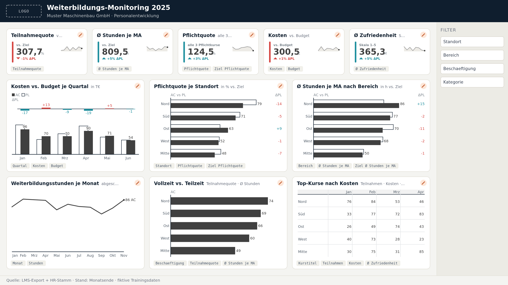

# Fall · Weiterbildungs-Monitoring

**Zum Selbermachen nach dem Training – etwa 3 Stunden, in Etappen machbar.**

Die **Muster Maschinenbau GmbH** (fiktiv, 420 Mitarbeitende, drei Standorte) will wissen, ob sie ihre
Weiterbildungsziele 2025 erreicht. Die Personalentwicklung liefert dir drei Dinge, wie sie im echten
Leben kommen: einen **unordentlichen Export aus dem Lernsystem (LMS)**, **Stammdaten aus dem HR-System** und
die **Ziele als Excel-Kreuztabelle**. Daraus baust du ein Modell und eine Übersichtsseite.

Du übst dabei alles aus den beiden Trainingstagen noch einmal – plus vier neue Handgriffe:
**Datei-Codierung**, **Duplikate**, **kaputte Schlüssel** (führende Nullen) und **Quoten mit dem richtigen Nenner**.

> **Hängst du fest?** Zu jedem Schritt gibt es ein fertiges Skript in [`skripte/`](skripte/). Einfügen,
> Kontrollzahl prüfen, weiter. Alle Zahlen stehen auch in [`daten/kontrollzahlen.json`](daten/kontrollzahlen.json).

---

## Was liegt hier?

| Ordner | Inhalt |
|---|---|
| [`daten/roh/`](daten/roh/) | `weiterbildung_buchungen_2025.csv` – LMS-Export, **absichtlich unordentlich** |
| [`daten/anreicherung/`](daten/anreicherung/) | `dim_mitarbeitende.csv` (HR-Stamm, pseudonymisiert) · `dim_bereich.csv` · `dim_kurs.csv` |
| [`daten/ziele/`](daten/ziele/) | `ziele_2025.xlsx` mit zwei Blättern (Budget je Quartal, Zielwerte je Kennzahl) + dieselben Tabellen als CSV |
| [`skripte/powerquery/`](skripte/powerquery/) | M-Code für jeden Lade- und Aufräumschritt – zum Überspringen |
| [`skripte/dax/`](skripte/dax/) | alle Measures mit Kontrollzahlen |
| [`mockup/`](mockup/) | Seitenentwurf aus der MockupKitchen – das Ziel dieses Falls |
| [`tools/`](tools/) | Skripte, die Daten und Mockup neu erzeugen (nur für Trainer:innen) |

Basis-Adresse für **Daten abrufen → Web** (Anmeldung **Anonym**):
```
https://raw.githubusercontent.com/Losveratos/Power-Starter-24-25-September/main/cases/weiterbildungs-monitoring/daten/
```
…plus Unterordner und Dateiname, z. B. `…/daten/roh/weiterbildung_buchungen_2025.csv`.

---

## Das Ziel: diese Seite



*Skizze aus der [MockupKitchen](https://datenwgknowledgekitchen.com/mockup-kitchen.html) – die Zahlen im Bild sind Platzhalter, die echten rechnest du aus.*

**Frage der Seite:** *Erreichen wir unsere Weiterbildungsziele 2025 – und wo müssen wir nachsteuern?*

Oben fünf Kennzahlen mit Ziel (Teilnahmequote, Ø Stunden je MA, Pflichtquote, Kosten vs. Budget,
Zufriedenheit), darunter die drei Stellen, an denen man nachsteuert: **Budget je Quartal**,
**Pflichtquote je Standort**, **Stunden je Bereich** – und unten Saison, Vollzeit/Teilzeit und die teuersten Kurse.
Die Begründung jeder Kachel steht in der [Workshop-Doku](mockup/WORKSHOP-DOKU.md).

---

## Schritt 1 · Den Rohexport ansehen (10 min)

Öffne `weiterbildung_buchungen_2025.csv` zuerst **im Editor** (nicht in Excel). Was fällt auf?

- Trennzeichen ist das **Semikolon**, Zahlen haben ein **Komma** (`7,5`), Kosten ein **€-Zeichen** (`1.234,50 €`).
- Datumswerte stehen als `TT.MM.JJJJ`.
- Die `Personalnr` hat **keine führenden Nullen** (`238`) – im HR-Stamm heißt dieselbe Person `00238`.
- Der `Status` ist mal `abgeschlossen`, mal `ABGESCHLOSSEN `, mal `teilgenommen`.
- Ganz unten steht eine Summenzeile. Manche Buchungen stehen **doppelt** drin.
- Die Datei ist in **Windows-1252** gespeichert, nicht in UTF-8.

---

## Schritt 2 · Rohdaten aufräumen (45 min)

1. **Daten abrufen → Web** → Adresse der Rohdatei → **Anonym**.
2. Im Vorschaufenster oben **Dateiursprung: 1252: Westeuropäisch (Windows)** und **Trennzeichen: Semikolon** wählen.
   Probier vorher einmal *65001: Unicode (UTF-8)* – dann siehst du, was mit `Präsenz` und `Datensätze` passiert.
3. **Daten transformieren.** Unter *Angewendete Schritte* alles nach **Höher gestufte Header** löschen.
4. Die Handgriffe:

| # | Problem | Handgriff |
|---|---|---|
| 1 | Summenzeile am Ende | **Start → Zeilen entfernen → Untere Zeilen entfernen** → `1` |
| 2 | Doppelte Buchungen | Spalte **BuchungsID** markieren → **Start → Zeilen entfernen → Duplikate entfernen** |
| 3 | Kurstitel doppelt (steht auch im Kurskatalog) | Spalte **Kurstitel** entfernen |
| 4 | Führende Nullen fehlen | **Personalnr** markieren → **Transformieren → Format → Präfix hinzufügen** hilft nicht (mal 2, mal 3 Nullen). Stattdessen **Spalte hinzufügen → Benutzerdefinierte Spalte**: `Text.PadStart([Personalnr], 5, "0")`, alte Spalte löschen, neue umbenennen |
| 5 | Status uneinheitlich | **Status** markieren → **Format → Kürzen**, dann **Format → Kleinbuchstaben**, dann **Werte ersetzen**: `teilgenommen` → `abgeschlossen`, `no show` und `nicht erschienen` → `No-Show`, `no-show` → `No-Show` |
| 6 | Euro-Zeichen | **Kosten** markieren → **Werte ersetzen**: ` €` (mit Leerzeichen davor) → *nichts* |
| 7 | Leeres Feedback | **Feedback** markieren → **Werte ersetzen**: *leer lassen* → `null` |
| 8 | Datentypen | Datumsspalten → **Datum**, **Stunden** → Dezimalzahl, **Kosten** → Währung, **Feedback** → Ganze Zahl. Diesmal **ohne** Gebietsschema-Umweg – die Datei ist deutsch wie dein Windows |

5. Abfrage `fakt_buchungen` nennen.

**✅ Kontrollpunkt:** **1.712 Zeilen**, 10 Spalten. Filterpfeil bei **Status** zeigt genau vier Werte:
`abgeschlossen` (1.587) · `storniert` (69) · `No-Show` (53) · `angemeldet` (3).

- *1.736 Zeilen?* → Duplikate noch drin (Handgriff 2).
- *1.713 Zeilen?* → Summenzeile noch drin (Handgriff 1). *1.737* → beides.
- *Mehr als vier Status-Werte?* → Kürzen oder Kleinbuchstaben vergessen.

⏭ **Überspringen:** [`01_fakt_buchungen.pq`](skripte/powerquery/01_fakt_buchungen.pq)

📚 Kitchen: [Power Query · Staging (Datentypen, Schlüssel bereinigen)](https://datenwgknowledgekitchen.com/power_bi_einsteiger_guide_v4.html#pq) ·
Microsoft Learn: [Text/CSV-Connector](https://learn.microsoft.com/de-de/power-query/connectors/text-csv) ·
[Mit Duplikaten arbeiten](https://learn.microsoft.com/de-de/power-query/working-with-duplicates) ·
[Datentypen und Gebietsschema](https://learn.microsoft.com/de-de/power-query/data-types)

---

## Schritt 3 · Anreichern: Dimensionen laden und Schlüssel prüfen (30 min)

1. Die drei CSVs aus `daten/anreicherung/` laden (UTF-8, Komma, Punkt als Dezimalzeichen – also **FTE** mit Gebietsschema *Englisch (USA)*).
2. Abfragen nennen: `dim_mitarbeitende`, `dim_bereich`, `dim_kurs`.
3. **Personalnr ist Text!** Sonst wird aus `00238` die Zahl `238` – und nichts passt mehr zusammen.
4. **Prüfen, ob die Schlüssel passen:** `fakt_buchungen` markieren → **Start → Abfragen zusammenführen als neue Abfrage** →
   unten `dim_mitarbeitende`, beide Male Spalte **Personalnr** markieren → Join-Art **Linker Anti (nur Zeilen in erster Tabelle)**.
   Das Ergebnis sind alle Buchungen **ohne** passende Person. Danach die Prüfabfrage mit Rechtsklick → *Laden aktivieren* abschalten.

**✅ Kontrollpunkt:** `dim_mitarbeitende` **420**, `dim_bereich` **7**, `dim_kurs` **23** Zeilen (davon **3** mit `Pflicht = Ja`).
Die Anti-Join-Prüfung ergibt **0 Zeilen**. Nimm testweise Handgriff 4 aus Schritt 2 heraus: Dann sind es **alle 1.712** – so sieht ein kaputter Schlüssel aus.

⏭ **Überspringen:** [`02a_dim_mitarbeitende.pq`](skripte/powerquery/02a_dim_mitarbeitende.pq) ·
[`02b_dim_bereich.pq`](skripte/powerquery/02b_dim_bereich.pq) · [`02c_dim_kurs.pq`](skripte/powerquery/02c_dim_kurs.pq) ·
[`03_pruefung_anti_join.pq`](skripte/powerquery/03_pruefung_anti_join.pq)

📚 Microsoft Learn: [Abfragen zusammenführen – Überblick](https://learn.microsoft.com/de-de/power-query/merge-queries-overview) ·
[Linker Anti-Join](https://learn.microsoft.com/de-de/power-query/merge-queries-left-anti)

---

## Schritt 4 · Ziele entpivotieren (30 min)

Die Personalentwicklung plant in Excel – **Bereiche in Zeilen, Quartale bzw. Kennzahlen in Spalten**.
Für Menschen perfekt, für Power BI unbrauchbar. Zwei Blätter, zweimal derselbe Handgriff.

**Blatt „Budget 2025":**
1. **Daten abrufen → Web** → `…/daten/ziele/ziele_2025.xlsx` → Blatt **Budget 2025** → **Daten transformieren**. Automatische Schritte nach *Navigation* löschen.
2. **Obere Zeilen entfernen** `2` → **Erste Zeile als Überschriften**.
3. Zeile **Gesamt** herausfiltern, Spalte **Summe** entfernen – Summen rechnet Power BI selbst.
4. **Bereich** markieren → **Transformieren → Spalten entpivotieren → Andere Spalten entpivotieren**. *Attribut* → `Quartal`, *Wert* → `Budget`.
5. **Benutzerdefinierte Spalte** `Quartalsanfang`: `#date(2025, (Number.From(Text.End([Quartal], 1)) - 1) * 3 + 1, 1)`, Typ Datum. Abfrage `Budget` nennen.

**Blatt „Zielwerte 2025":** dasselbe ohne Gesamt/Summe. *Attribut* → `Kennzahl`, *Wert* → `Zielwert` (Dezimalzahl). Abfrage `Zielwerte` nennen.

**✅ Kontrollpunkt:** `Budget` **28 Zeilen**, Summe **274.500 €**. `Zielwerte` **28 Zeilen**; die Teilnahmequote steht als **0,75**, nicht als 75 – das „%" in Excel war nur Formatierung.

⏭ **Überspringen:** [`04_budget_entpivotieren.pq`](skripte/powerquery/04_budget_entpivotieren.pq) · [`05_zielwerte_entpivotieren.pq`](skripte/powerquery/05_zielwerte_entpivotieren.pq)

📚 Kitchen: [Praxis-Pfad · Exkurs „Warum deine Excel-Tabelle nicht passt"](https://datenwgknowledgekitchen.com/powerbi_praxis_pfad.html#exkurs) ·
Microsoft Learn: [Spalten entpivotieren](https://learn.microsoft.com/de-de/power-query/unpivot-column)

---

## Schritt 5 · Kalender und Beziehungen (25 min)

1. **Automatisches Datum/Uhrzeit aus** (Datei → Optionen → Aktuelle Datei → Datenladevorgang).
2. Kalender per Leerer Abfrage aus [`06_kalender.pq`](skripte/powerquery/06_kalender.pq), **als Datumstabelle markieren**, `Monat` nach `MonatNr` sortieren.
3. Beziehungen, alle **n:1**, Filterrichtung **einfach**:

| Von (n) | Nach (1) |
|---|---|
| `fakt_buchungen[Personalnr]` | `dim_mitarbeitende[Personalnr]` |
| `fakt_buchungen[Kursnr]` | `dim_kurs[Kursnr]` |
| `fakt_buchungen[Kursbeginn]` | `Kalender[Datum]` |
| `dim_mitarbeitende[BereichID]` | `dim_bereich[BereichID]` |
| `Budget[Bereich]` | `dim_bereich[Bereich]` |
| `Budget[Quartalsanfang]` | `Kalender[Datum]` |
| `Zielwerte[Bereich]` | `dim_bereich[Bereich]` |

> `dim_bereich` hängt an `dim_mitarbeitende` statt direkt am Fakt – eine kleine **Schneeflocke**. Das ist hier in
> Ordnung, weil Budget und Ziele eine eigene Bereichstabelle brauchen. Wer es ganz sauber will, führt `Bereich` per
> *Abfragen zusammenführen* in `dim_mitarbeitende` mit und lässt `dim_bereich` nur für Budget und Ziele stehen.

**✅ Kontrollpunkt:** Tabelle `dim_bereich[Bereich]` × Anzahl `dim_mitarbeitende[Personalnr]`: Produktion **150**, Logistik **55**, Entwicklung **60**, Service **45**, Vertrieb **45**, IT **25**, Verwaltung **40**.

📚 Kitchen: [Datenmodellierung · Sternschema, Kalender, Modell-Prinzipien](https://datenwgknowledgekitchen.com/power_bi_einsteiger_guide_v4.html#model) ·
Microsoft Learn: [Sternschema](https://learn.microsoft.com/de-de/power-bi/guidance/star-schema) ·
[Beziehungen verstehen](https://learn.microsoft.com/de-de/power-bi/transform-model/desktop-relationships-understand) ·
[Datumstabellen](https://learn.microsoft.com/de-de/power-bi/transform-model/desktop-date-tables)

---

## Schritt 6 · Grundgrößen (20 min)

Leere Tabelle `_Measures` anlegen, dann: `Headcount`, `Buchungen`, `Teilnahmen`, `Stunden`, `Kosten`
(Formeln in [`measures.dax`](skripte/dax/measures.dax)).

**✅ Kontrollpunkt:** Headcount **420** · Buchungen **1.712** · Teilnahmen **1.587** · Stunden **6.894** · Kosten **272.678,91 €**

---

## Schritt 7 · Quoten mit dem richtigen Nenner (40 min)

Die wichtigste Lektion dieses Falls: **Wer ist „alle"?**

- `Ø Stunden je MA = DIVIDE ( [Stunden], [Headcount] )` – geteilt durch **alle** 420, nicht nur durch die, die in der
  Buchungstabelle vorkommen. Wer nie auf einer Schulung war, gehört zur Belegschaft und muss den Schnitt drücken.
- `Teilnahmequote` = Personen mit mindestens einer **freiwilligen** abgeschlossenen Weiterbildung ÷ Headcount (`DISTINCTCOUNT` + `CALCULATE`).
- `Pflichtquote` = Personen, die **alle drei** Pflichtkurse abgeschlossen haben ÷ Headcount. Das ist das anspruchsvollste
  Measure: `FILTER` über die Mitarbeitenden, je Person zählen, wie viele Pflichtkurse sie hat. Lies es in
  [`measures.dax`](skripte/dax/measures.dax) Zeile für Zeile.
- `Ø Zufriedenheit = AVERAGE ( fakt_buchungen[Feedback] )` – hier ist der Mittelwert **richtig**: jede Bewertung zählt gleich.
  Leere Bewertungen sind `null` und werden nicht mitgezählt (deshalb Handgriff 7 in Schritt 2).

**✅ Kontrollpunkt (gesamt):** Ø Stunden je MA **16,41** · Teilnahmequote **63,3 %** · Pflichtquote **79,5 %** · Stornoquote **4,0 %** · No-Show-Quote **3,1 %** · Ø Zufriedenheit **3,78**

**Und nach Standort** (Matrix `dim_mitarbeitende[Standort]` × `Pflichtquote`):

| Standort | Headcount | Pflichtquote | Ø Stunden je MA |
|---|---:|---:|---:|
| Zentrale Hannover | 156 | 92,3 % | 16,24 |
| Werk Kassel | 119 | 88,2 % | 17,08 |
| **Werk Ulm** | 145 | **58,6 %** | 16,06 |

Nimm `dim_kurs[Kurstitel]` dazu: In Ulm fehlt vor allem **Datenschutz-Grundlagen** – ein E-Learning, und in
Produktion und Logistik gibt es kaum PC-Arbeitsplätze. Nur **62,3 %** dort haben es abgeschlossen.

**Vollzeit vs. Teilzeit** (`dim_mitarbeitende[Beschaeftigung]`): Ø Stunden **17,86 h** vs. **9,79 h**, Teilnahmequote **69,0 %** vs. **37,3 %**.

📚 Kitchen: [DAX · CALCULATE, Filterkontext, Anti-Patterns](https://datenwgknowledgekitchen.com/power_bi_einsteiger_guide_v4.html#dax) ·
Microsoft Learn: [DIVIDE](https://learn.microsoft.com/de-de/dax/divide-function-dax) ·
[CALCULATE](https://learn.microsoft.com/de-de/dax/calculate-function-dax) ·
[Variablen in DAX](https://learn.microsoft.com/de-de/dax/best-practices/dax-variables)

---

## Schritt 8 · Ziele und Budget (30 min)

- `Budget`, `Δ Budget`, `Budget-Ausschöpfung` – einfache Summen über die entpivotierte Tabelle.
- `Ziel Ø Stunden je MA` & Co.: Jeder Bereich hat ein eigenes Ziel. Für **mehrere** Bereiche zusammen wird das Ziel
  **nach Headcount gewichtet** (`SUMX` über die Bereiche) – sonst zählt die IT mit 25 Leuten so viel wie die Produktion mit 150.

**✅ Kontrollpunkt:** Budget **274.500 €** · Budget-Ausschöpfung **99,3 %** · Ziel Ø Stunden **16,5** · Ziel Teilnahmequote **75,0 %** · Ziel Pflichtquote **95,0 %**

Gesamt sieht das Budget gut aus. Aber:

| | Kosten | Budget | Ausschöpfung |
|---|---:|---:|---:|
| **Q2** (alle Bereiche) | 116.223 € | 77.000 € | **151 %** |
| **Vertrieb** (Jahr) | 45.039 € | 37.000 € | **121,7 %** |
| Vertrieb nur Q2 | 39.543 € | 10.500 € | 377 % |

*Die Vertriebsoffensive im Frühjahr hat Premium-Seminare gebucht – im Jahressaldo versteckt, im Quartal unübersehbar.*

> Budget liegt nur je **Quartal** vor. Zeig es nie nach Monat – dort wäre es falsch verteilt (Granularität).

📚 Kitchen: [Visualisierung & IBCS · Plan-Ist-Notation](https://datenwgknowledgekitchen.com/power_bi_einsteiger_guide_v4.html#viz) ·
Microsoft Learn: [SUMX](https://learn.microsoft.com/de-de/dax/sumx-function-dax)

---

## Schritt 9 · Die Seite bauen (45 min)

Bau die Seite nach dem [Mockup](mockup/page-1-uberblick.png). Die Kachel-Liste mit Feldern steht in der
[Workshop-Doku](mockup/WORKSHOP-DOKU.md), die Maße in [`AGENT-BRIEF.md`](mockup/AGENT-BRIEF.md).

- **Nur mit Bordmitteln:** KPI-Kacheln als *Karte (neu)* mit Referenzbeschriftung, Balken und Säulen als *Gruppiertes Balken-/Säulendiagramm* mit Ist und Ziel.
- **Mit ChartKitchen:** Die Kacheln mit Szenario-Notation (Ist vs. Ziel, Abweichung) sind im Mockup für das Visual
  [ChartKitchen byDatenWG](https://datenwgknowledgekitchen.com/chartkitchen-schnellstart.html) vorgesehen.
- **Lösung ansehen:** Das fertige Power-BI-Projekt liegt in [`pbip/Weiterbildungs-Monitoring/`](../../pbip/Weiterbildungs-Monitoring/) – `.pbip` öffnen, aktualisieren, vergleichen.
- **Mit Claude Code:** Speichere dein Modell als **PBIP** und sag im Repo: *„Setz das Mockup `cases/weiterbildungs-monitoring/mockup/mockup-spec.json` in meinem Bericht um."* – der Skill `mockup-to-powerbi` baut die Seite (siehe [skills.md](../../skills.md)).
- **Weiterskizzieren:** [MockupKitchen](https://datenwgknowledgekitchen.com/mockup-kitchen.html) öffnen → **Öffnen** → [`weiterbildungs-monitoring.mockup.json`](mockup/weiterbildungs-monitoring.mockup.json). Dort kannst du Kacheln ändern oder eine Detailseite ergänzen.

📚 Kitchen: [Interaktivität · Drillthrough, Tooltips, bedingte Formatierung](https://datenwgknowledgekitchen.com/power_bi_einsteiger_guide_v4.html#inter)

---

## ⚠️ Personaldaten

Weiterbildungsdaten sind **personenbezogen**. In diesem Fall sind sie erfunden und pseudonymisiert (nur Personalnummern).
Im echten Leben gilt:

- Die Übersichtsseite zeigt **keine Einzelpersonen** – Bereich, Standort und Kurs reichen für die Steuerung.
- Bei kleinen Gruppen (z. B. 3 Teilzeitkräfte in der IT) lässt sich trotzdem auf Personen schließen. Mindestgröße vereinbaren.
- Führungskräfte sehen nur ihren Bereich → **Row-Level Security**. Betriebsrat und Datenschutz früh einbinden.

📚 Kitchen: [Row-Level Security](https://datenwgknowledgekitchen.com/power_bi_einsteiger_guide_v4.html#rls) ·
Microsoft Learn: [RLS-Leitfaden](https://learn.microsoft.com/de-de/power-bi/guidance/rls-guidance)

---

## ⭐ Wenn du noch Lust hast

- **Detailseite je Bereich** per Drillthrough: Kurse, Stunden, offene Pflichtschulungen.
- **Anzahl offener Pflichtschulungen** als Measure: `[Headcount] - [Pflicht erfüllt]`.
- **Kosten je Teilnahmestunde** nach Kategorie – welche Kurse sind teuer, welche nur lang?
- **Eintrittsjahr** aus `dim_mitarbeitende[Eintritt]`: Bekommen neue Kolleg:innen mehr Weiterbildung?
- Das Budget per Feldparameter wahlweise nach Bereich oder Quartal zeigen.

---

## Für Trainer:innen

```bash
pip install openpyxl playwright
python3 cases/weiterbildungs-monitoring/tools/generate_data.py            # Daten + kontrollzahlen.json
python3 cases/weiterbildungs-monitoring/tools/build_mockup.py ../PowerBI-Kitchen-   # Mockup mit der echten MockupKitchen
```
Die Geschichten in den Daten: Werk Ulm hängt beim Datenschutz-E-Learning hinterher · der Vertrieb sprengt im Q2 das
Budget · Teilzeitkräfte bekommen nur halb so viel Weiterbildung · E-Learnings werden schlechter bewertet als Präsenzkurse.
